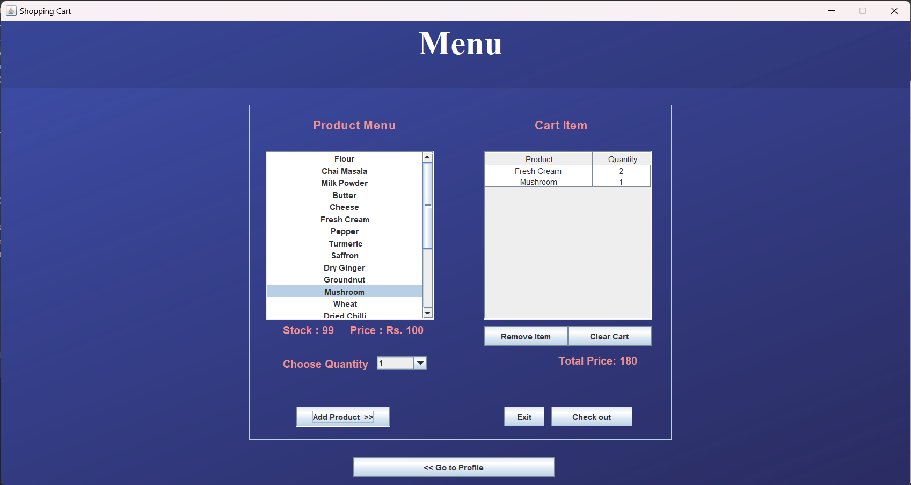

# General Store Billing

This is a billing application. It can be used to add items to cart and generate bills. It is written in Java, GUI is implemented using Java swing and the application is connected to MySQL using JDBC.

## Requirements
MySQL server containing billing database (which can be found in data directory of this project)

## Project Structure
In the main project directory there is a src sub directory which contains two directories; bills and images.  
Bills is a package which contains all the java files having the classes which implement the main functionalities required for this project.  
Images contains the background image used in the GUI.  
The project directory contains an .iml file which contains the module configuration for the project.

## Functions
### HomePage
This window presents three options: login, signup and exit.  

### Signup
Signup form consists of 5 inputs all of which are required to signup.  

### Login
Login form requires username and password to validate the user.  

### User Profile
Login and signup both will be redirected to this window on successful validation of user. User profile contains the date of last transaction. If null, "You haven't made any transactions yet" is displayed. A button to show previous user transactions. Also, a button to take you to the shop or exit.  

### Menu (Shop)
This window contains a product GUI on the left side and a checkout GUI on the right side. On checking out, a bill will be generated. When the SHOW button will be clicked then the transaction will be final.  

### Previous Bills
On clicking View Previous Bills on the user profile page, the window will show a table consisting of past transactions. If null, "No Transactions yet" will be displayed.  

### Database Connectivity
A singleton class is created to instantiate a single database object to use throughout the project.

## Database
2 tables are used in this project: customers and bills.  
